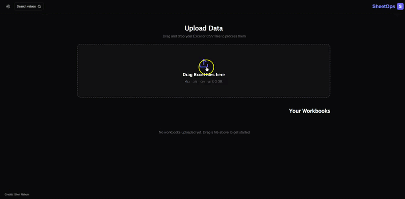
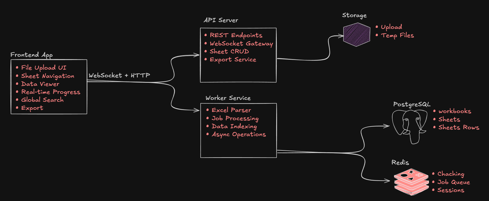

# SheetOps 

**Transform Excel files into live, production-ready APIs in minutes.**

SheetOps is a comprehensive platform that enables you to upload Excel workbooks and instantly convert them into queryable, scalable REST APIs. Perfect for enterprise environments, air-gapped networks, and scenarios where traditional database setup is overkill.


##  Features

- **Drag & Drop Upload** - Simple UI for uploading Excel files
- **Instant API Generation** - Automatic REST API creation from Excel sheets
- **Multi-Sheet Support** - Full support for workbooks with multiple sheets
- **Live Data Search** - Search across all cell values in real-time
- **Cell-Level API Access** - Get/Set individual cells, rows, columns
- **Offline/Air-Gapped Ready** - Deploy in completely isolated networks
- **WebSocket Updates** - Real-time upload progress and notifications
- **Scalable Architecture** - Background workers process files asynchronously
- **TypeORM + PostgreSQL** - Structured data storage with JSONB support
- **Redis Caching** - High-performance caching layer
- **Comprehensive Export** - Download workbooks as Excel files

## 🏗️ Architecture



### Components

| Component | Tech Stack | Purpose |
|-----------|-----------|---------|
| **Frontend** | React 18, Vite, Tailwind CSS | User interface for uploads and data exploration |
| **API Server** | NestJS, Express | REST API and WebSocket gateway |
| **Worker** | NestJS, Bull, Node.js | Background job processing for Excel parsing |
| **Database** | PostgreSQL 15 | Persistent storage with JSONB for sheet data |
| **Cache/Queue** | Redis 7 | Job queue and application caching |
| **Storage** | File System | Upload and temporary file storage |

## 🚀 Quick Start

### Prerequisites

- Docker & Docker Compose 20.10+
- Or: Node.js 18+, PostgreSQL 15+, Redis 7+

### Option 1: Docker Compose (Recommended)

```bash
# Clone the repository
git clone <repository-url>
cd SheetOps

# Start the entire stack
docker-compose up --build -d

# View logs
docker-compose logs -f

# Stop services
docker-compose down
```

The application will be available at:
- **Frontend**: http://<app-domain>:3000
- **API**: http://<app-domain>:3001/api/v1
- **API Docs**: http://<app-domain>:3001/api

## 📖 Usage

### 1. Upload an Excel File

1. Open http://<app-domain>:3000
2. Drag and drop an Excel file (`.xlsx`, `.xls`, `.csv`)
3. File processing starts automatically
4. Progress updates in real-time via WebSocket

### 2. Explore Data

- **Sheet Tabs** - Navigate between sheets
- **Search** - Search across all cell values
- **Cell Navigation** - Click cells to see API paths
- **Export** - Download the workbook as Excel

### 3. Use the API

**By Clicking on The Value, you will get his specific API**
#### List Sheets
```bash
curl http://<app-domain>:3001/api/v1/workbooks/{id}
```

#### Get Sheet Data
```bash
curl "http://<app-domain>:3001/api/v1/workbooks/{id}/sheets/{sheetId}/rows?page=0&pageSize=100"
```

#### Get Specific Cell
```bash
curl "http://<app-domain>:3001/api/v1/workbooks/{id}/sheets/{sheetId}/cells/{rowIndex}/{colIndex}"
```

#### Get Row
```bash
curl "http://<app-domain>:3001/api/v1/workbooks/{id}/sheets/{sheetId}/rows/{rowIndex}"
```

#### Get Column
```bash
curl "http://<app-domain>:3001/api/v1/workbooks/{id}/sheets/{sheetId}/columns/{colIndex}"
```

#### Update Cell
```bash
curl -X PATCH \
  "http://<app-domain>:3001/api/v1/workbooks/{id}/sheets/{sheetId}/cells" \
  -H "Content-Type: application/json" \
  -d '{
    "cells": [
      {"rowIndex": 0, "colIndex": 0, "value": "New Value"}
    ]
  }'
```

#### Search
```bash
curl "http://<app-domain>:3001/api/v1/workbooks/search?q=keyword&limit=50"
```

#### Export
```bash
curl "http://<app-domain>:3001/api/v1/workbooks/{id}/export" \
  -o workbook.xlsx
```

### 4. API Keys (Optional)

Generate API keys for programmatic access:
```bash
curl -X POST \
  "http://<app-domain>:3001/api/v1/workbooks/{id}/api-keys" \
  -H "Content-Type: application/json" \
  -d '{"name": "My API Key"}'
```

Use in requests:
```bash
curl -H "X-API-Key: your-key" \
  "http://<app-domain>:3001/api/v1/workbooks/{id}/sheets/{sheetId}/rows"
```

## 🏢 Air-Gapped Network Deployment

SheetOps is designed to work in completely isolated, air-gapped networks:

### Pre-Requirements
- All Docker images pre-loaded (no internet access needed)
- PostgreSQL and Redis available
- File storage on local volumes

### Deployment Steps

1. **Build Docker Images**
```bash
docker-compose build
docker save -o sheetops-images.tar \
  sheetops-api \
  sheetops-worker \
  sheetops-frontend \
  postgres:15-alpine \
  redis:7-alpine
```

2. **Transfer to Air-Gapped Network**
```bash
# Transfer sheetops-images.tar to isolated network
```

3. **Load Images**
```bash
docker load < sheetops-images.tar
```

4. **Start Services**
```bash
docker-compose up -d
```


## 🐳 Docker Compose Services

```yaml
Services:
  postgres:15-alpine     - Database (port 5432)
  redis:7-alpine         - Cache & Queue (port 6379)
  api:                   - NestJS API (port 3001, internal)
  worker:                - Job Processor (internal)
  frontend:              - React UI (port 3000)
```

### Environment Variables

Create `.env` file:
```env
# Database
POSTGRES_DB=sheetops
POSTGRES_USER=sheetops
POSTGRES_PASSWORD=changeme

# Storage
UPLOAD_DIR=/data/uploads
TEMP_DIR=/data/temp

# API
NODE_ENV=production
API_PORT=3001

# Redis
REDIS_HOST=redis
REDIS_PORT=6379
```

## 📚 API Documentation

Full API documentation available at: http://<app-domain>:3001/api

### Base URL
```
http://<app-domain>:3001/api/v1
```

### Key Endpoints

| Method | Endpoint | Description |
|--------|----------|-------------|
| `GET` | `/workbooks` | List all workbooks |
| `GET` | `/workbooks/{id}` | Get workbook details with sheets |
| `POST` | `/workbooks/{id}/upload` | Upload Excel file |
| `GET` | `/workbooks/{id}/sheets` | List sheets |
| `GET` | `/workbooks/{id}/sheets/{sheetId}/rows` | Get paginated rows |
| `GET` | `/workbooks/{id}/sheets/{sheetId}/rows/{rowIndex}` | Get specific row |
| `GET` | `/workbooks/{id}/sheets/{sheetId}/cells/{row}/{col}` | Get cell value |
| `PATCH` | `/workbooks/{id}/sheets/{sheetId}/cells` | Update cells |
| `GET` | `/workbooks/{id}/sheets/{sheetId}/columns/{colIndex}` | Get column |
| `GET` | `/workbooks/{id}/export` | Export as Excel |
| `GET` | `/workbooks/search?q=query` | Search across data |


## 📦 Deployment

### #TODO: Kubernetes/Helm Chart

### Docker Compose (Production)

```bash
# Build images
docker-compose build

# Start services (detached)
docker-compose up -d

# View logs
docker-compose logs -f

# Stop services
docker-compose down

# Remove all data
docker-compose down -v
```

## 🛡️ Security

### Authentication
- API Key support for programmatic access
- CORS configuration for frontend access
- Request validation and sanitization

### Data Protection
- Passwords encrypted in database
- No sensitive data in logs
- HTTPS ready (configure in production)

### Network
- Services communicate over internal network (docker-compose)
- PostgreSQL and Redis not exposed externally
- API behind frontend router

## 📊 Supported Formats

| Format | Support | Notes |
|--------|---------|-------|
| `.xlsx` | ✅ Full | Modern Excel format (recommended) |
| `.xls` | ✅ Full | Legacy Excel format |
| `.csv` | ✅ Full | Comma-separated values |

### File Limitations
- Maximum file size: 100MB (configurable)
- Maximum sheets per workbook: No limit
- Maximum rows per sheet: No limit (limited by storage)
- Maximum columns: No limit

---


